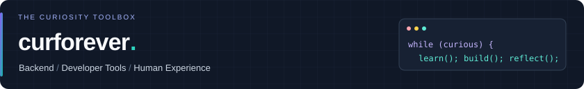
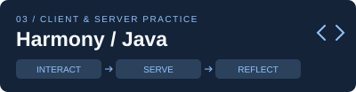
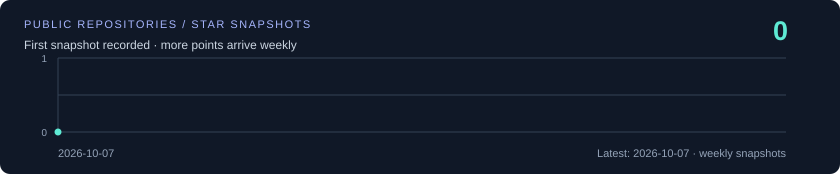

<b>简体中文</b> · <a href="README.en.md">English</a>

**你好，我是 curforever 👋** · 做过 Harmony 客户端与 Java 服务端开发，关注性能优化与人机交互。

喜欢把复杂问题拆成能验证的小问题，也喜欢把反复做的事变成顺手的工具。这里收纳我的工程实践、研究经历和一些有用的折腾：端与服务、VR 研究、AI 工具、博客与开源贡献。

 

[🏆 核心实践](#user-content-work) · [🧰 技术栈](#user-content-stack) · [📦 公开项目](#user-content-projects) · [📚 技术之外](#user-content-beyond) · [🎓 经历与成果](#user-content-experience) · [💬 交流](#user-content-contact)

## 🏆 核心项目与实践

<table>
<tr>
<td width="50%" valign="top">

<b>Agent Skills · 系统整理，让方法可复用</b> 
系统收集、分类和维护开发、学习、沟通与项目管理 Skills。把一次次有效的方法留下来，让 AI Agent 更懂任务，也更守规矩。  
<code>分类组织</code> <code>代码阅读</code> <code>项目交接</code>  
<a href="https://github.com/curforever/curforever-skills/tree/main/skills/development/code-reading-coach">代码阅读范例 →</a> · <a href="https://github.com/curforever/curforever-skills">技能目录 →</a>
</td>
<td width="50%" valign="top">

<b>毕业研究 · 从感知质量到端边协同</b> 
一个完整的 VR / HCI 研究链路：第三章按眼动任务调节中心凹渲染，第四章复用多人共享视场缓存，第五章完成端边协同系统与实验；论文组织与代码共同支撑这一整体。  
<code>任务感知</code> <code>缓存复用</code> <code>系统集成</code>  
<a href="#user-content-research">研究脉络 →</a> · 相关源码暂未公开
</td>
</tr>
<tr>
<td width="50%" valign="top">

<b>端与服务 · 两端都做过，继续往深处走</b> 
华为软件开发实习中参与 Java 服务端需求开发；HarmonyOS 菁英班中开发健康打卡 App，实践声明式 UI、状态管理与交互优化。  
<code>ArkTS / ArkUI</code> <code>Java</code> <code>业务闭环</code>  
<a href="#user-content-experience">经历与收获 →</a> · 关注可用性，也关注实现机制
</td>
<td width="50%" valign="top">

<b>博客 · 把输入整理成下一次的工具</b> 
留下技术实践、读书与播客笔记。精选入口先讲重点，旧笔记保留在归档里；正在重新整理，让积累更容易被找到。  
<code>技术记录</code> <code>阅读笔记</code> <code>思考复盘</code>  
<a href="https://curforever.github.io/">精选入口 →</a> · <a href="https://curforever.github.io/archives/">历史归档 →</a>
</td>
</tr>
<tr>
<td width="50%" valign="top">

<b>开源贡献 · 不只 Fork，也递交补丁</b> 
已向《代码随想录》提交并合并 4 个 PR：补充 Java 实现、修正复杂度分析、完善注释与文档。后续项目的贡献也会汇集在这里。  
<code>Java 实现</code> <code>文档修正</code> <code>4 PRs merged</code>  
<a href="https://github.com/youngyangyang04/leetcode-master/pull/2915">A* Java 实现 →</a> · <a href="https://github.com/search?q=is%3Apr+author%3Acurforever+-user%3Acurforever&amp;type=pullrequests">全部对外 PR →</a>
</td>
<td width="50%" valign="top">

<b>兴趣实验室 · 输入设备到界面体验</b> 
客制化机械键盘记录手感与选型，CSS 案例练习界面表达。屏幕之外会跑步、打篮球；偶尔开黑，也喜欢研究团队怎样配合。  
<code>机械键盘</code> <code>CSS</code> <code>运动与协作</code>  
<a href="https://github.com/curforever/Keyboard">键盘记录 →</a> · <a href="https://github.com/curforever/CSSLearning">CSS 小实验 →</a>
</td>
</tr>
</table>

## 🧰 技术栈 · 从客户端到服务端，也关心性能与体验

| 方向 | 工具与技术 | 我关注的问题 |
| :--- | :--- | :--- |
| **客户端开发** |    | 声明式 UI、组件复用、状态管理、交互反馈与真机调试 |
| **服务端开发** |     | IoC / DI、AOP、接口与业务校验、定时任务与幂等重试 |
| **数据与分布式** |    | 索引与事务、缓存一致性、消息队列、分库分表与锁粒度 |
| **性能优化** |    | 慢查询定位与执行计划、并发机制、缓存复用与渲染开销 |
| **人机交互研究** |    | 眼动任务感知、中心凹渲染、多用户共享视场与端边协同 |
| **工程工具与基础** |    | 源码阅读、可复用 AI 工作流、知识沉淀、TCP / HTTP 与 I/O |

## 📦 项目索引 · 公开仓库，一句话说明白

<!-- PUBLIC_PROJECTS_START -->
| 项目 | Stars | Forks | 用途与边界 |
| :--- | :---: | :---: | :--- |
| [Agent Skills](https://github.com/curforever/curforever-skills) |  |  | 开发、学习与项目管理技能集 |
| [博客站点](https://github.com/curforever/curforever.github.io) |  |  | 精选技术、阅读与播客笔记 |
| [键盘记录](https://github.com/curforever/Keyboard) |  |  | 试轴照片、手感体验与选型清单 |
| [CSS 实验](https://github.com/curforever/CSSLearning) |  |  | CSS 学习案例与界面探索 |
| [开源贡献](https://github.com/curforever/leetcode-master) |  |  | Fork：补充 Java、修正文档；4 个 PR 已合并 |
| [外卖平台](https://github.com/curforever/CangQiongWaiMai-Java) |  |  | 课程练习：业务、缓存与 Spring |
| [博客源码](https://github.com/curforever/HexoBlogBackup) |  |  | Hexo 内容、主题与站点配置 |
| [主页工程](https://github.com/curforever/curforever) |  |  | 中英文主页、展示素材与指标刷新 |
<!-- PUBLIC_PROJECTS_END -->

 · 仅收录公开仓库，每周刷新；Fork 与课程练习单独标明。

## 📚 技术之外 · 好奇心也需要输入

  

| 我的输入频道 | 怎么输入，也怎么输出 | 一个具体入口或例子 |
| :--- | :--- | :--- |
| **📖 阅读 · 看人，也看组织** | 从人物传记、企业发展到工作方法，留下问题与思考 | [《小米创业思考》笔记](https://curforever.github.io/2025/01/24/%E8%AF%BB%E4%B9%A6%E7%AC%94%E8%AE%B0%E3%80%8A%E5%B0%8F%E7%B1%B3%E5%88%9B%E4%B8%9A%E6%80%9D%E8%80%83%E3%80%8B/) · 关注专注、取舍和创造价值 |
| **🎧 播客 · 通勤也有缓存** | 利用碎片时间听思考与生活话题，把值得追问的内容记下来 | [信息筛选笔记](https://curforever.github.io/2025/01/11/%E6%92%AD%E5%AE%A2%E7%AC%94%E8%AE%B0%E3%80%8A%E4%B8%8D%E6%AD%A2%E9%87%91%E9%92%B1_06%20%E4%BF%A1%E6%81%AF%E6%97%B6%E4%BB%A3%E6%B8%85%E9%86%92%E6%B3%95%E5%88%99%20%E8%BF%BD%E6%B1%82%E4%BF%A1%E6%81%AF%20%E4%BD%86%E4%B8%8D%E6%98%AF%E8%B6%8A%E5%A4%9A%E8%B6%8A%E5%A5%BD%E3%80%8B/) · 信息筛选、有效认知、长期主义 |
| **🌍 英语 · 每天一点点** | 长期单词学习，也把英文资料用于技术阅读 | CET-4 617 / CET-6 614；高中英语教师资格证 |
| **✍️ 写作 · 给未来的自己留日志** | 做前理清问题，做中记录证据，做后审核与复盘 | [博客与历史笔记](https://curforever.github.io/) · [代码阅读方法](https://github.com/curforever/curforever-skills/tree/main/skills/development/code-reading-coach) |
| **🏃 运动 · 给大脑散热** | 跑步调节节奏，篮球练习配合；晴天慢跑，雨天核心训练 | 不追求把每个爱好都变成 KPI，保持精力才能持续投入 |
| **⌨️ 折腾 · 手感和像素都想调一调** | 从键盘选型到 CSS 小实验，关注日常工具和界面体验 | [键盘记录](https://github.com/curforever/Keyboard) · [CSS 实验](https://github.com/curforever/CSSLearning) |

## 🎓 经历与成果 · 不只列标签，也留下做过的事

| 阶段 | 经历 | 方向与收获 |
| :--- | :--- | :--- |
| **2023–2026** | **东南大学 · 软件学院 · 硕士阶段** | 虚拟现实、人机交互与渲染优化；从方法研究走到系统集成 |
| **2019–2023** | **合肥工业大学 · 计算机学院 · 本科阶段** | 计算机基础、软件实践与算法竞赛 |
| **2025.07–09** | **华为 · 软件开发实习（服务端）** | 业务校验、定时重试与并发控制；学习需求对齐、代码评审和交付流程 |
| **2025.07** | **HarmonyOS 菁英班 · 小组实践** | 健康打卡 App；功能开发、交互优化与真机演示，获组内优秀个人 |

### 🥽 研究脉络 · 感知 → 复用 → 协同

**毕业研究是一个整体**：第三章用 Transformer 与感知元学习识别眼动任务、调整中心凹渲染参数；第四章围绕多用户共享视场，以 Double DQN 探索对象块缓存复用；第五章把端侧感知与边侧复用集成到统一系统，并开展实验评估。

**另一项研究成果**：CSCWD 2025 第一作者论文，研究多用户 VR 影院中虚拟角色的动作、声音真实感对用户体验的影响。

| 代表性成果 | 内容 |
| :--- | :--- |
| **🏅 奖学金与荣誉** | 国家级奖学金 · 东南大学三好研究生 · 合肥工业大学优秀毕业生 |
| **💻 技术竞赛** | 中国软件杯国家三等奖（图书管理系统，小组实践）· 全国大学生数学建模竞赛安徽省二等奖 · 蓝桥杯省二等奖 |
| **🌍 语言与表达** | 全国大学生英语竞赛 C 类二等奖 · CET-4 617 / CET-6 614 · 高中英语教师资格证 |
| **🤝 实践与分享** | HarmonyOS 菁英班优秀理论小组、优秀实践小组、组内优秀个人；实习期间获评社区贡献达人 |

## ⭐ 开源积累 · 让有用的东西慢慢被看见

统计当前公开、非 Fork 仓库的 Stars 总量，按周记录快照；从首次采集开始积累，后续自动连成趋势线。

## 💬 有想法、问题或合作机会？欢迎一起聊聊

欢迎在 [Issues 留言](https://github.com/curforever/curforever/issues)，交流技术、反馈工具，或者一起把有意思的想法做出来。

## 🛠️ 持续更新工具箱，偶尔造轮子，希望轮子能转。
