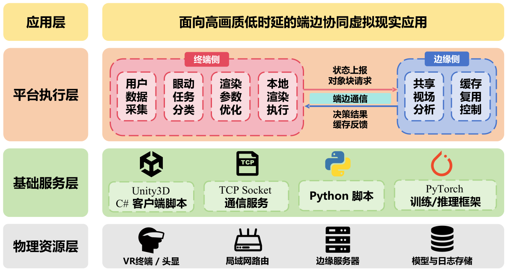
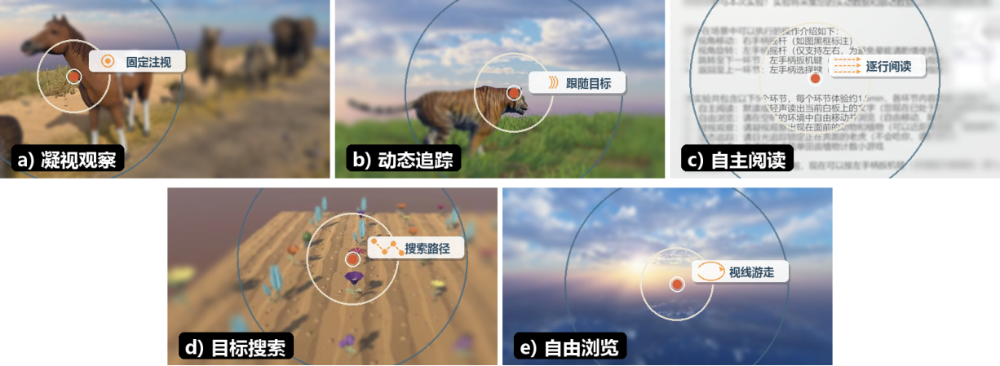
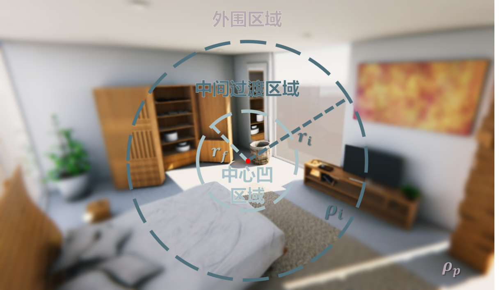
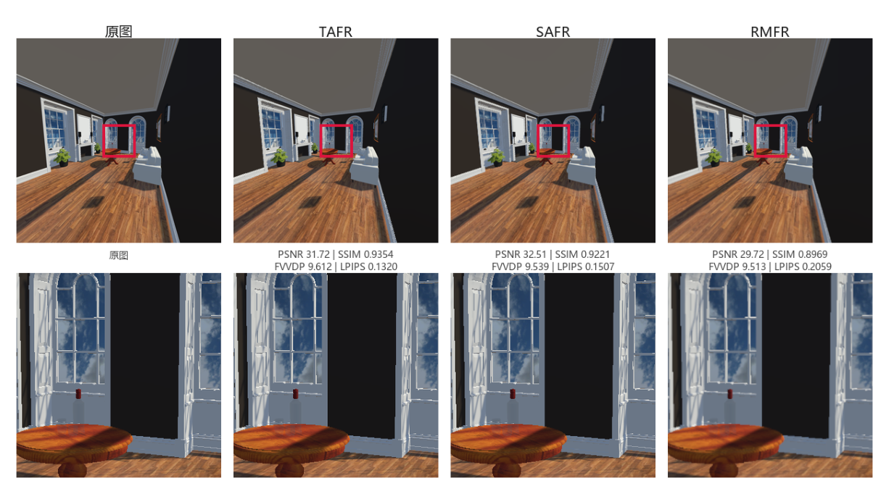
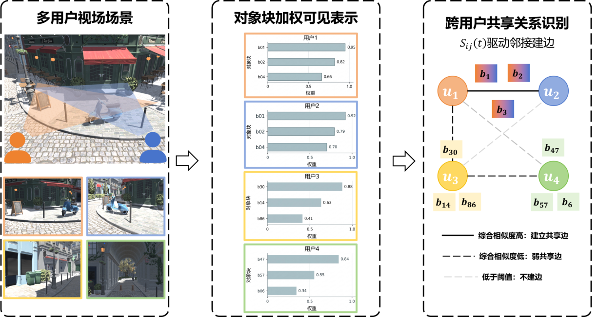
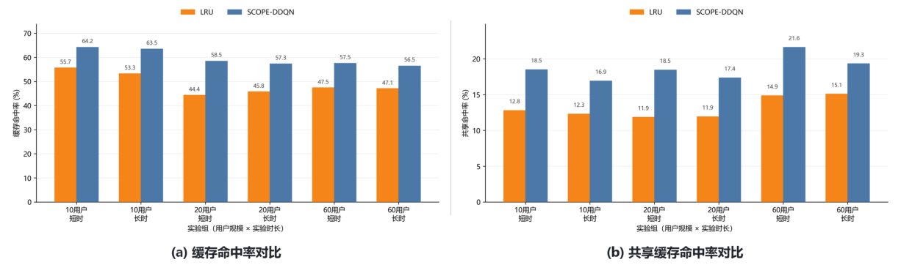
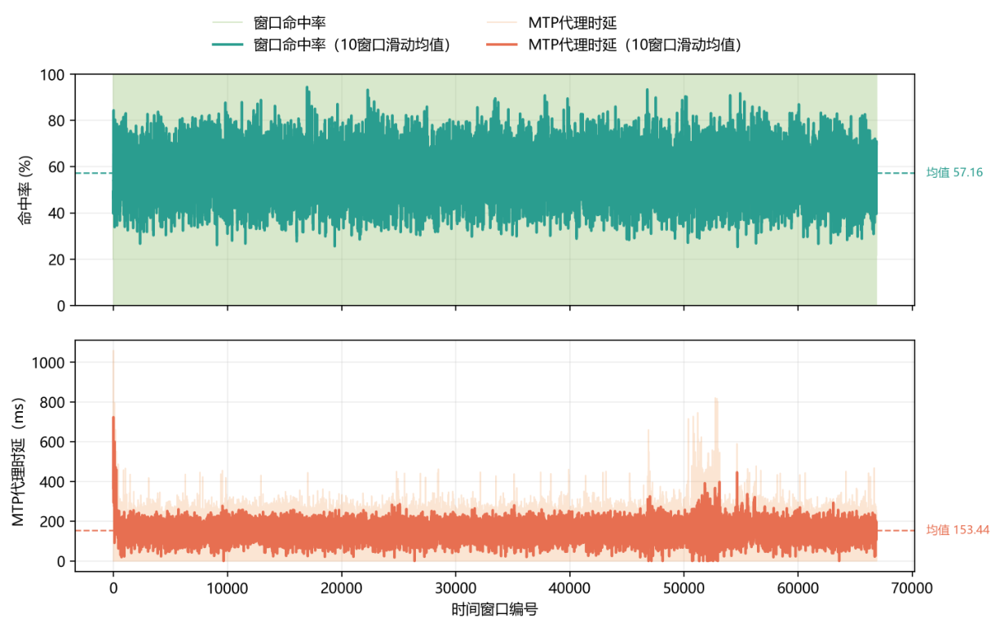

<a href="README.md">简体中文</a> · <b>English</b> · <a href="../README.en.md">Back to profile</a>

# 🥽 VR research: use computation where people need it

One connected thesis project: task-aware foveated rendering on the client, shared-view cache reuse at the edge, and an integrated system for evaluation. Figures are extracted from the final thesis body; source repositories remain private. Results below reproduce thesis summaries, not newly rerun experiments.

## The system at a glance

| Part | Plain-language question | Work |
| :--- | :--- | :--- |
| Client | Which details matter for the user's current task? | Head/eye observations, task classification, foveation control |
| Edge | Can several users reuse the same content? | Shared object blocks, grouping, cache decisions |
| Connection | What must both sides exchange? | State reports, object requests, decisions and feedback |

## Task-aware rendering

The method recognizes five task types from head/eye sequences, adjusts the center/transition regions and peripheral resolution, and smooths parameter changes. The classifier reports **93.85 ± 0.26% accuracy in sample-level five-fold cross-validation**; this is not evidence of equivalent accuracy on entirely unseen users.

| Strategy | Mean segment frame time | Mean segment over-budget ratio | Speed-up vs full resolution |
| :--- | ---: | ---: | ---: |
| Full resolution | 10.14 ± 2.99 ms | 33.42% | 1.00× |
| SCFR baseline | 5.58 ± 2.95 ms | 6.09% | 1.82× |
| TAFR | 5.40 ± 2.97 ms | 4.81% | 1.88× |

Source: final thesis Table 3.7, printed page 48. Statistics are computed within scene–route segments, then averaged across segments. The rendering speed-up is not an end-to-end VR system speed-up. Image quality is evaluated using several metrics; TAFR does not win every metric in every scene.

## Shared views and cache decisions

SCOPE-DDQN explores cache insertion, retention, prefetching and eviction using shared-content value. Chapter 4 evaluates the method; Chapter 5 evaluates the integrated system. Their workloads and statistics must be kept separate.

## Integrated system results

| Workload | LRU hit rate | SCOPE-DDQN hit rate | LRU shared hit rate | SCOPE-DDQN shared hit rate |
| :--- | ---: | ---: | ---: | ---: |
| 10 users · short | 55.72% | 64.22% | 12.80% | 18.51% |
| 10 users · long | 53.30% | 63.49% | 12.32% | 16.92% |
| 20 users · short | 44.37% | 58.47% | 11.86% | 18.47% |
| 20 users · long | 45.79% | 57.34% | 11.94% | 17.37% |
| 60 users · short | 47.47% | 57.55% | 14.87% | 21.63% |
| 60 users · long | 47.12% | 56.48% | 15.10% | 19.34% |

Source: Table 5.4, printed page 84. Six paired conditions, twelve runs. Multi-user requests are generated in a controlled simulation; actual headset integration verifies the client and communication pipeline. The 20-user short condition gains **14.10 percentage points**, or roughly **31.78% relative improvement**.

| Across six paired conditions | Mean relative gain | Bootstrap 95% confidence interval |
| :--- | ---: | ---: |
| Cache hit rate | 22.08% | [18.31%, 26.51%] |
| Shared-cache hit rate | 42.78% | [35.46%, 49.23%] |

Source: Table 5.5, printed page 85. These are averages of per-condition relative gains.

The long-run window hit-rate mean is **57.16%**. The **153.44 ms proxy latency** measures edge request processing through response generation. It is neither network round-trip latency nor headset end-to-end Motion-to-Photon latency.

## Implementation and limits

| Component | Implementation |
| :--- | :--- |
| Client | Unity 2022.3 LTS, C#, Pico 4 Enterprise integration |
| Edge | Python 3.10, PyTorch 2.1, shared-view cache decisions |
| Communication | TCP Socket and structured JSON |

These experiments support a working pipeline and benefits within the evaluated settings. Unseen-user generalization, different devices/scenes, real multi-user deployments and complete end-to-end experience require further validation.

[More original figures and explanations in Chinese](README.md#user-content-gallery) · [Figure sources](assets/sources.json) · [Questions and feedback](https://github.com/curforever/curforever/issues)
