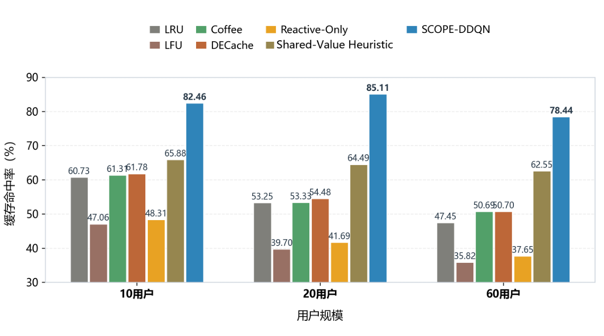
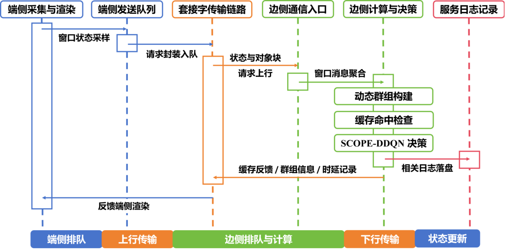
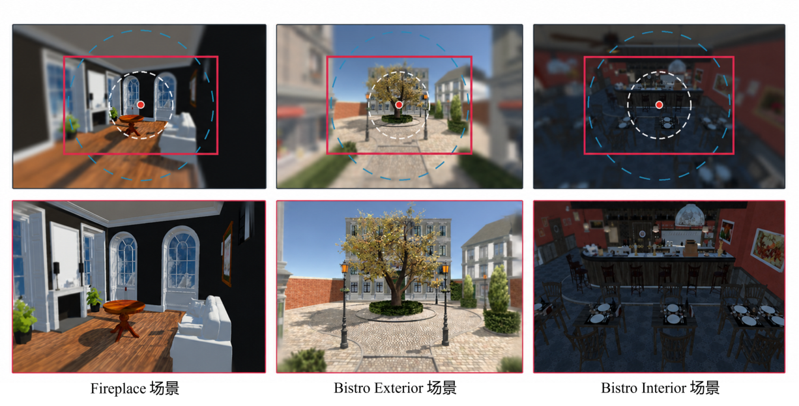
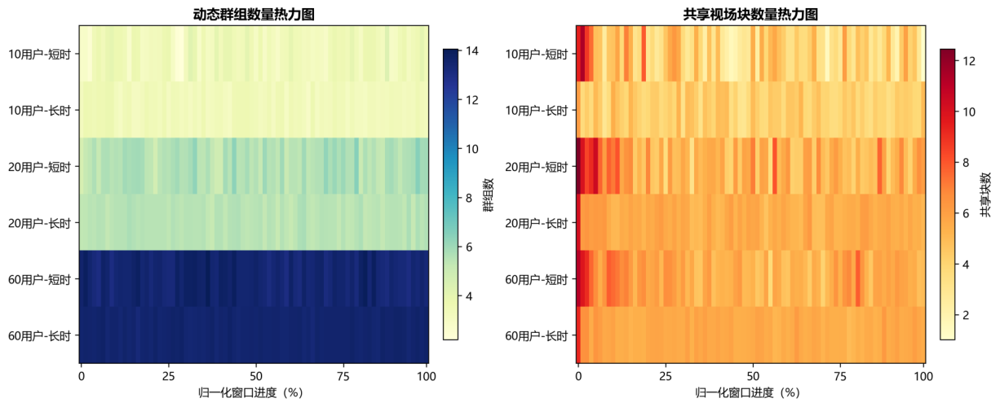
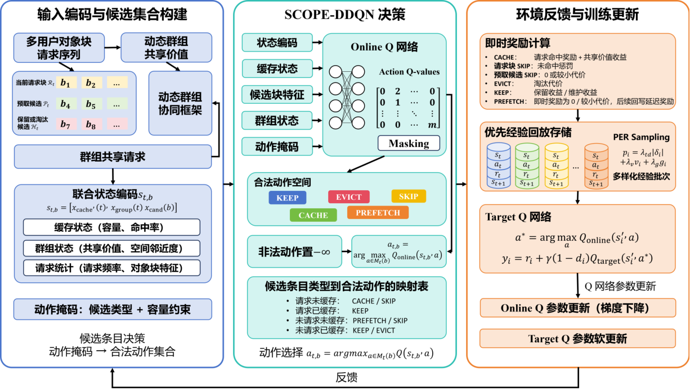
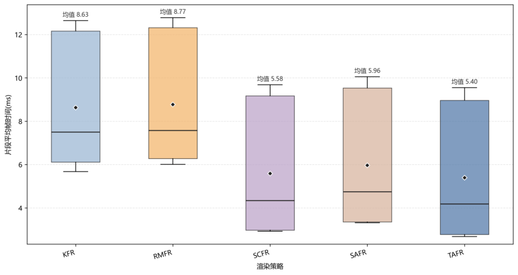
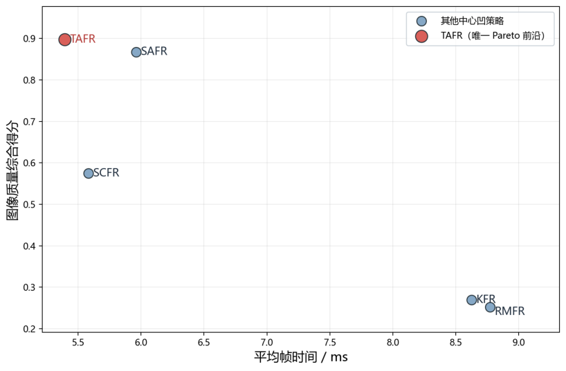
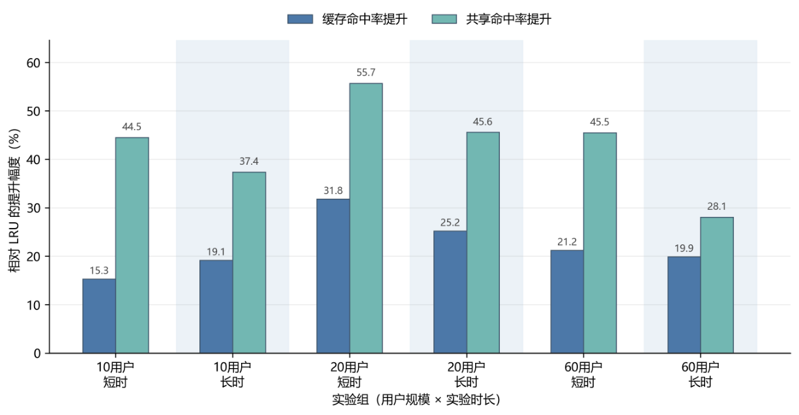

<b>简体中文</b> · <a href="README.en.md">English</a> · <a href="../README.md">返回主页</a>

# 🥽 VR 研究：把算力用在用户真正需要的地方

**用户关注的区域要清楚，多人重复的处理可以少做一点。** 我的毕业研究把眼动任务识别、渲染参数控制、共享缓存与端边通信接成一条可评估的链路。

| 研究工作 | 怎么解决 | 论文中观察到的结果 |
| :--- | :--- | :--- |
| **任务感知渲染** | 根据眼动任务调整细节区域与分辨率 | 片段平均帧时间：10.14 → 5.40 ms |
| **多人缓存复用** | 识别共享对象块，学习缓存调度 | 六组系统条件中，命中率平均相对增益 22.08% |
| **系统集成与评估** | Unity 终端 + Python 边缘服务 + TCP 通信 | 真实头显链路验证；60 用户仿真负载运行 30 分钟 |

图表与数字来自终版论文；不同实验的条件在下文分别说明。代码仓库保持私有。

## 一张图看懂系统：端侧按需，边侧复用

**看图路线：**终端采集头动与眼动 → 识别任务并调整画面 → 向边缘服务发送状态与对象块请求 → 返回缓存决策与结果。

[① 任务与画质](#user-content-perception) · [② 共享与缓存](#user-content-reuse) · [③ 系统结果](#user-content-results) · [④ 实现与原图](#user-content-gallery)

| 系统位置 | 用日常语言解释 | 在做什么 |
| :--- | :--- | :--- |
| **终端侧** | 用户此刻需要哪里更清楚？ | 采集头动与眼动，识别当前任务，调整高质量区域与外围画质 |
| **边缘侧** | 有没有其他人刚用过同一份内容？ | 比较不同用户的可见对象，识别共享机会，决定缓存保留、写入、预取与淘汰 |
| **通信链路** | 两端要知道哪些事情？ | 上报状态与对象块请求，返回决策与缓存结果 |

这三部分对应论文第三、四、五章：先分别验证方法，再接成系统。本页复述论文中的实验汇总，没有重新执行实验。

## ② 同一个注视点，不一定需要同一套画质

阅读文字、追踪移动目标、搜索物体，对细节和视野范围的要求不同。中心凹渲染把画面分为三层；我的方法进一步考虑用户正在做什么，再调节各层范围与分辨率。

| 处理步骤 | 输入与输出 | 为什么需要这一步 |
| :--- | :--- | :--- |
| **观察行为** | 一段头动、眼动序列 | 单个注视点无法完整说明任务 |
| **识别任务** | 五类任务的概率 | 区分凝视、追踪、阅读、搜索和浏览 |
| **分配细节** | 中心与过渡区范围、外围分辨率 | 把更多资源留给当前任务关心的区域 |
| **平滑调整** | 连续变化的参数 | 避免参数频繁跳变影响体验 |

### 怎么评价“画面还好、开销更低”？

| 渲染策略 | 片段平均帧时间 | 平均片段超预算比例 | 相对全分辨率加速比 |
| :--- | ---: | ---: | ---: |
| 全分辨率渲染 | 10.14 ± 2.99 ms | 33.42% | 1.00× |
| SCFR 对比策略 | 5.58 ± 2.95 ms | 6.09% | 1.82× |
| **TAFR 任务感知策略** | **5.40 ± 2.97 ms** | **4.81%** | **1.88×** |

来源：终版论文表 3.7，正文第 48 页。以场景—路径片段为统计单元，先在每个片段内计算，再对片段取平均。这里的加速比只说明这组渲染实验，不能直接解释为整个 VR 系统都快了 1.88 倍。

图像质量用 PSNR、SSIM、LPIPS、FovVideoVDP 等指标共同评估。TAFR 的总体 SSIM 与 LPIPS 表现较好，但并非每个场景、每个指标都最优。任务识别模型的准确率为 **93.85 ± 0.26%**，对应的是**样本级五折交叉验证**，不能据此声称对完全未见用户有同等准确率。

## ③ 多人看到同一部分场景，可以共享什么？

不同用户的位置与朝向不同，但仍可能同时看到同一个对象。把场景内容表示成对象块后，就能识别这些重叠部分，并用共享价值辅助缓存调度。

| 缓存要回答的问题 | 对应动作 |
| :--- | :--- |
| 新内容值不值得放进来？ | 写入 |
| 哪些内容接下来还可能被多人使用？ | 保留或预取 |
| 容量不足时先让谁腾位置？ | 淘汰 |

SCOPE-DDQN 用当前状态和反馈学习这些选择。收益应与 LRU 等规则策略比较，也要检查决策开销和高负载表现；算法更复杂并不自动意味着系统更好。

这张图属于**第四章方法实验**。下面属于**第五章集成系统实验**，两者的请求流程和统计口径不同，所以数字不应拼在一起当作一条性能曲线。

## ④ 接成系统后，收益还能留下多少？

| 用户规模与时长 | LRU 命中率 | SCOPE-DDQN 命中率 | LRU 共享命中率 | SCOPE-DDQN 共享命中率 |
| :--- | ---: | ---: | ---: | ---: |
| 10 用户 · 短时 | 55.72% | 64.22% | 12.80% | 18.51% |
| 10 用户 · 长时 | 53.30% | 63.49% | 12.32% | 16.92% |
| 20 用户 · 短时 | 44.37% | 58.47% | 11.86% | 18.47% |
| 20 用户 · 长时 | 45.79% | 57.34% | 11.94% | 17.37% |
| 60 用户 · 短时 | 47.47% | 57.55% | 14.87% | 21.63% |
| 60 用户 · 长时 | 47.12% | 56.48% | 15.10% | 19.34% |

来源：终版论文表 5.4，正文第 84 页。六个条件分别比较两种方法，共 12 组实验；多用户请求由可控仿真生成，真实头显接入用于验证采集、渲染和通信链路。

**看一个直观例子：** 20 用户短时条件下，缓存命中率从 44.37% 到 58.47%，增加 **14.10 个百分点**，相对增加约 **31.78%**。“百分点”与“相对百分比”是两种不同说法。

| 六组成对条件的汇总 | 平均相对增益 | Bootstrap 95% 置信区间 |
| :--- | ---: | ---: |
| 缓存命中率 | 22.08% | [18.31%, 26.51%] |
| 共享命中率 | 42.78% | [35.46%, 49.23%] |

来源：终版论文表 5.5，正文第 85 页。这是六组相对增益的均值，不是把每组百分点差值平均后得到的结果。

### 能不能持续运行？

这张图观察的是长时运行趋势：窗口级命中率均值 **57.16%**，边缘处理代理时延均值约 **153.44 ms**。代理时延衡量边缘服务接收请求到生成响应的处理过程；它不等于真实网络往返时延，更不等于头显端到端 Motion-to-Photon 时延。窗口级均值与全程命中率的聚合方式不同，数字可能略有差异。

## ⑤ 实现脉络与更多原图

| 实现部分 | 技术与工作 |
| :--- | :--- |
| 终端与场景 | Unity 2022.3 LTS、C#、Pico 4 Enterprise 接入、任务驱动参数调整 |
| 边缘缓存 | Python 3.10、PyTorch 2.1、动态群组与对象块共享、缓存决策 |
| 两端通信 | TCP Socket、结构化 JSON、状态上报与结果反馈 |
| 实验组织 | 方法对比、消融、集成系统对比、30 分钟长时运行分析 |

<b>展开查看通信、运行效果和更多实验原图</b>

### 两端怎么交换状态

### 系统运行中怎样改变画面细节

### 共享机会如何随用户变化

### 缓存模型如何组织决策

### 渲染开销与图像质量怎样同时观察

### 六组系统条件中的相对增益

## 这份展示能说明什么，还有什么边界？

| 能支持的结论 | 需要继续验证的部分 |
| :--- | :--- |
| 任务识别、渲染控制、共享缓存可以接成可运行链路 | 换设备、换场景、换真实用户后的效果 |
| 当前方法与系统实验中观察到质量、开销及缓存收益 | 跨用户泛化；模型与决策开销的进一步优化 |
| 可控多用户负载下能比较缓存收益与长时趋势 | 大规模真实用户部署、无线网络变化与端到端体验 |

我在这项研究中做的是：把问题拆成可测量的模块，把模块接成系统，再用不同口径的实验解释各自的收益与代价。

原图来源与页码：[素材索引](assets/sources.json)。更多交流：[GitHub Issues](https://github.com/curforever/curforever/issues)。
